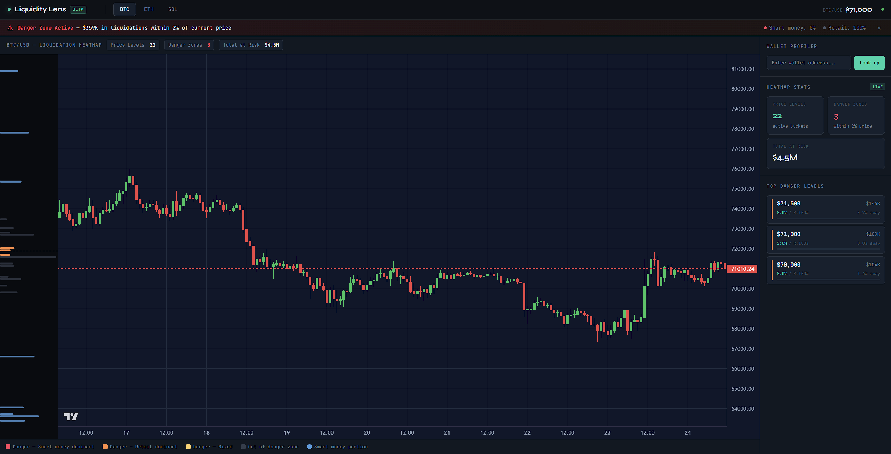

# Liquidity Lens

> Real-time liquidation heatmap and wallet profiler for Pacifica — built for the Pacifica Hackathon.

Liquidity Lens visualises **where leveraged positions will be forcibly closed** across BTC, ETH and SOL markets on Pacifica. Traders can identify dangerous price zones, understand whether liquidation clusters are driven by smart money or retail, and profile any wallet's trading behaviour — all in one dashboard.

---

## Demo

> 🎥 _Demo video link — to be added after recording_



---

## Features

| Feature | Description |
|---|---|
| **Liquidation Heatmap** | Price buckets showing total USD at liquidation risk per level, rendered as a D3 sidebar alongside a live candlestick chart |
| **Danger Zone Detection** | Automatic highlight of buckets within 2% of current price — banner alert with total USD at immediate risk |
| **Smart Money vs Retail** | Each bucket coloured by composition: 🔴 smart-money dominant · 🟠 retail dominant · 🟡 mixed |
| **Wallet Profiler** | Score 0–100 per address based on win rate, avg hold time, position size consistency, and trade count |
| **Multi-market** | BTC / ETH / SOL toggle — independent heatmaps, price feeds, and bucket sizes per market |
| **Real-time** | Pacifica WebSocket price feed → Socket.io push to frontend; positions re-polled every 5 min |
| **Mock mode** | `USE_MOCK_DATA=true` runs fully offline with pre-seeded positions for all three markets |

---

## Architecture

```
Pacifica WebSocket ──► WsClient ──► price updates ──► Store (per-market)
                                        │
Pacifica REST API ───► RestPoller ──► positions ──► LiqCalculator ──► HeatmapBuckets
                                                                           │
                                                               Socket.io ──► Frontend
                                                               REST API  ──► /api/heatmap
                                                                           │
Binance REST ────────────────────────────────────────────────────────── PriceChart (candles)
```

---

## Tech Stack

| Layer | Tech |
|---|---|
| Backend | Node.js 18+, Express 5, Socket.io 4, TypeScript 5 |
| Frontend | Next.js 16, React 19, Lightweight Charts 5, D3 7 |
| Styling | Tailwind CSS 4 |
| Data source | Pacifica DEX REST API + WebSocket (Solana testnet) |
| Chart candles | Binance public klines API |
| Cache | node-cache (in-memory, per-market) |
| Tests | Jest 30 + Supertest — 119 tests across 8 suites |
| Builder | `devincrypt` (Pacifica Builder Program) |

---

## Getting Started

### Prerequisites

- Node.js 18+
- A Solana wallet with testnet SOL (for real data mode)
- Pacifica testnet access: [test-app.pacifica.fi](https://test-app.pacifica.fi)

### 1. Clone and install

```bash
git clone <repo-url>
cd LiquidityLens

# Backend
cd backend && npm install

# Frontend
cd ../frontend && npm install
```

### 2. Configure environment

```bash
cd backend
cp .env.example .env
# Edit .env — see variables below
```

### 3. Run

```bash
# Terminal 1 — backend (port 4000)
cd backend && npm run dev

# Terminal 2 — frontend (port 3000)
cd frontend && npm run dev
```

Open [http://localhost:3000](http://localhost:3000)

### Quick start with mock data

No Pacifica account needed — set `USE_MOCK_DATA=true` in `backend/.env` to run with pre-seeded positions for BTC, ETH and SOL.

---

## Environment Variables

All variables are in `backend/.env.example`:

| Variable | Required | Default | Description |
|---|---|---|---|
| `PACIFICA_REST_URL` | ✅ | `https://test-api.pacifica.fi/api/v1` | Pacifica REST API base URL |
| `PACIFICA_WS_URL` | ✅ | `wss://test-ws.pacifica.fi/ws` | Pacifica WebSocket URL |
| `PACIFICA_PRIVATE_KEY` | ✅ | — | Solana wallet private key (base58) — used for signing REST requests |
| `BUILDER_CODE` | ✅ | — | Pacifica Builder Program code |
| `PORT` | | `4000` | Backend HTTP port |
| `PRICE_BUCKET_SIZE` | | `500` | BTC price bucket size in USD (overridden per-market in code) |
| `DANGER_ZONE_PCT` | | `2` | % from current price to flag as danger zone |
| `WALLET_HISTORY_LIMIT` | | `200` | Max trades fetched per wallet |
| `WALLET_REFRESH_INTERVAL_MS` | | `300000` | Wallet re-poll interval (5 min) |
| `SEED_ACCOUNTS` | | — | Comma-separated wallet addresses to pre-load on startup |
| `USE_MOCK_DATA` | | `false` | Skip live API, use built-in mock positions |

---

## API Reference

### REST

| Method | Endpoint | Description |
|---|---|---|
| `GET` | `/api/heatmap?market=BTC` | Liquidation buckets for a market (`BTC` / `ETH` / `SOL`) |
| `GET` | `/api/wallet/:address` | Wallet score, label, and trading stats |
| `GET` | `/api/health` | Server status, per-market prices and bucket counts |

**Heatmap response:**
```json
{
  "market": "BTC",
  "currentPrice": 71000,
  "buckets": [
    {
      "priceLevel": 71000,
      "totalLiqUsd": 109000,
      "longLiqUsd": 109000,
      "shortLiqUsd": 0,
      "smartMoneyPct": 0,
      "retailPct": 100,
      "walletCount": 3,
      "isDangerZone": true
    }
  ],
  "timestamp": 1711234567890
}
```

### WebSocket (Socket.io)

| Event | Direction | Description |
|---|---|---|
| `heatmap:snapshot` | Server → Client | Full heatmap for all markets on connect |
| `heatmap:update` | Server → Client | Incremental update after each rebuild |

---

## Tests

```bash
cd backend
npm test
```

119 tests across 8 suites covering:
- Liquidation calculator (bucket building, danger zone detection)
- Wallet classifier (scoring algorithm)
- REST poller (signing, position parsing)
- API routes (heatmap, wallet, health endpoints)
- Integration scenarios (mock data end-to-end)

---

## Project Structure

```
LiquidityLens/
├── backend/
│   ├── src/
│   │   ├── engine/
│   │   │   ├── liqCalculator.ts   # bucket building, danger zone detection
│   │   │   ├── walletClassifier.ts# scoring algorithm (0–100)
│   │   │   └── store.ts           # in-memory per-market cache
│   │   ├── ingestion/
│   │   │   ├── restPoller.ts      # Pacifica REST — positions, trade history
│   │   │   └── wsClient.ts        # Pacifica WebSocket — live prices
│   │   ├── api/
│   │   │   ├── routes.ts          # Express REST endpoints
│   │   │   └── socketServer.ts    # Socket.io push server
│   │   ├── mock/
│   │   │   └── mockData.ts        # 48 pre-seeded positions (BTC/ETH/SOL)
│   │   ├── config.ts
│   │   ├── types.ts
│   │   └── index.ts               # entry point
│   ├── __tests__/                 # 8 test suites, 119 tests
│   ├── .env.example
│   └── package.json
└── frontend/
    ├── app/
    │   ├── page.tsx               # main dashboard
    │   └── layout.tsx
    ├── components/
    │   ├── PriceChart.tsx         # Lightweight Charts candlestick + LIQ lines
    │   ├── HeatmapChart.tsx       # D3 sidebar — liquidation level bars
    │   ├── WalletLookup.tsx       # wallet address input + score display
    │   ├── DangerZoneBanner.tsx   # top alert banner
    │   └── MarketSelector.tsx     # BTC / ETH / SOL tabs
    ├── hooks/
    │   ├── useHeatmap.ts          # Socket.io subscription + REST fallback
    │   └── useWallet.ts           # wallet score fetcher
    └── package.json
```

---

## Hackathon

Built for the **Pacifica Hackathon** — [pacifica.gitbook.io/docs/hackathon](https://pacifica.gitbook.io/docs/hackathon/pacifica-hackathon)

- Builder code: `devincrypt`
- Network: Solana testnet ([test-app.pacifica.fi](https://test-app.pacifica.fi))
- Builder Program: [pacifica.gitbook.io/docs/programs/builder-program](https://pacifica.gitbook.io/docs/programs/builder-program)

---

## License

MIT
